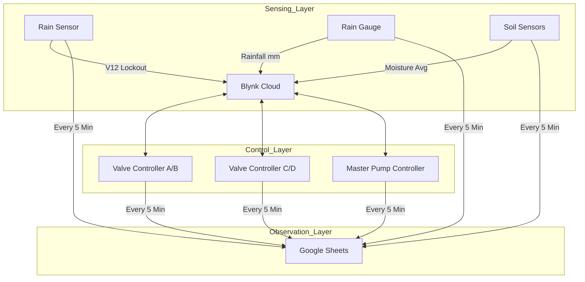

# System Process Flow: Smart Irrigation JSK 🌿💧

This document explains the technical "brain" of the system—how the 8 ESP32 nodes interact, how safety logic is enforced, and how your data reaches the cloud.

---

## 1. The Distributed Network
The system is **decentralized**. There is no single "Master" computer. Instead, each node looks at the **Blynk Cloud** to see what the other nodes are doing.

---

## 2. Daily Irrigation Cycles
The system follows a strict schedule using Internet Time (NTP).

### **Phase A: Fertilizer (Node: ALTF4)**
- **Time**: 08:00 AM
- **Sequence**:
  1. Open **Valve A** (Inlet) for 5 seconds (Half-Open).
  2. Open **Valve B** (Outlet) Fully.
  3. Master Pump detects Valve B is open and starts pumping.

### **Phase B: Watering (Node: Cyberspark)**
- **Times**: 10:00 AM, 12:00 PM, 02:00 PM, 04:00 PM
- **Sequence**:
  1. Open **Valve C** (Inlet) for 5 seconds (Half-Open).
  2. Open **Valve D** (Outlet) Fully.
  3. Master Pump detects Valve D is open and starts pumping.

---

## 3. Safety Interlocks & Protection
Safety is the #1 priority to prevent hardware damage.

| Safety Trigger | Logic | Result |
| :--- | :--- | :--- |
| **Rain Lockout (V12)** | Triggered by Aieman (Rain), Abdul (mm), or Syahdiq (Wet Soil). | All scheduled cycles are **Cancelled**. |
| **Dry-Run Protection** | Pump (Node: DTBuddy) checks Flow E (Node: Flexxy) after 15s. | If Flow < 0.1 L/min, **Emergency Shutdown** of Pump & Valves. |
| **2-Minute Cap** | Every cycle is limited to 120 seconds maximum. | Prevents water waste if a sensor fails. |
| **Hardware Watchdog** | All nodes monitor their own loop status. | Automatic **Self-Reboot** within 30s if code freezes. |

---

## 4. The Data Pipeline (Logging)
Your 7-day observation data follows this path:

1. **Step 1 (Physical)**: Sensor reads data (e.g., Moisture = 45%).
2. **Step 2 (Local)**: ESP32 checks if the change is significant (**Delta Check**).
3. **Step 3 (Blynk)**: Value sent to Blynk App for live viewing (60s interval).
4. **Step 4 (Bridge)**: Every 5 minutes, each node makes an HTTPS GET request to **Google Apps Script**.
5. **Step 5 (Merging)**: The script waits for all 8 nodes and merges them into **ONE consolidated row** in Google Sheets.

---

## 5. Daily Maintenance Cycle
- **Midnight (00:00)**: Node **Aieman** automatically resets the `Rain Lockout (V12)` flag to `0`. 
- **Goal**: This allows the system to attempt irrigation the next day even if it rained yesterday.

---

### **Summary of Success**
By separating the logic across 8 nodes, the system is nearly "Un-Crashable." If one node loses power, the others keep sensing, and your Google Sheets will simply record "blank" for that node until it comes back online.
